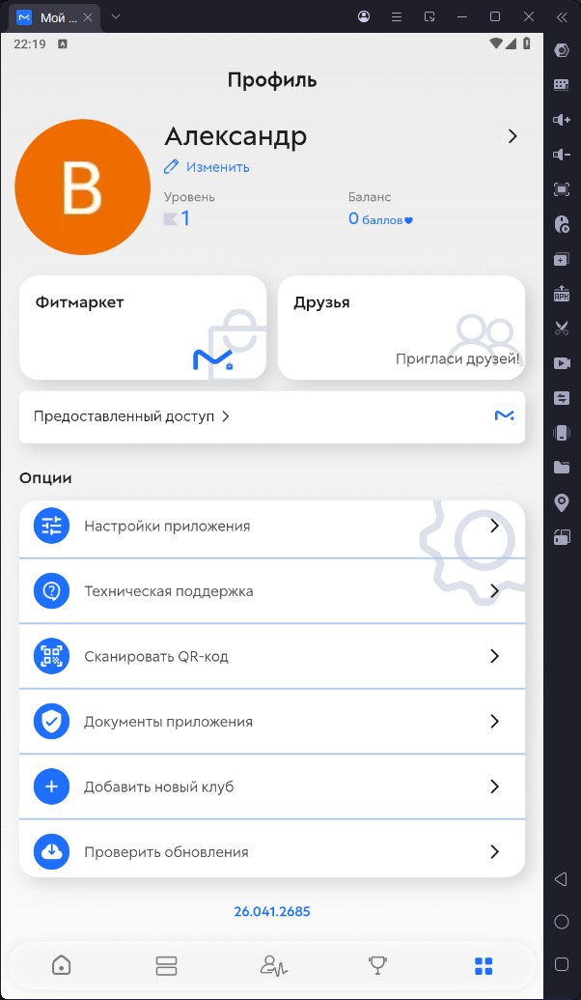

# Отчёт о функциональном тестировании приложения «Мой Фитнес»

## 1. Информация о сборке

| Параметр | Значение |
|----------|----------|
| **Приложение** | Мой Фитнес |
| **Ожидаемая версия сборки** | 26.051.2790 |
| **Фактическая версия сборки** | 26.051.2790 |
| **Дата тестирования** | _дд.мм.гггг_ |
| **Устройство** | _модель, ОС_ |
| **Тестировщик** | _ФИО_ |

> **Примечание:** Если версия не соответствует 26.051.2790 — выполнена переустановка. Отметить: версия соответствует

---

## 2. Результаты функционального тестирования

### 2.1 Регистрация

| № | Проверка | Статус | Дефект / Примечание |
|---|----------|--------|---------------------|
| 1 | Почта | | |
| 2 | Apple ID | | |
| 3 | Google | | |
| 4 | VK | | |

### 2.2 Авторизация

| № | Проверка | Статус | Дефект / Примечание |
|---|----------|--------|---------------------|
| 1 | Почта | | |
| 2 | Apple ID | | |
| 3 | Google | | |
| 4 | VK | | |

### 2.3 Подключение устройств

| № | Проверка | Статус | Дефект / Примечание |
|---|----------|--------|---------------------|
| 1 | HUAWEI Health | | |
| 2 | Apple Health | | |
| 3 | Google Fit | | |
| 4 | Health Connect | | |
| 5 | Пульсометр | | |
| 6 | Напрямую с телефона | | |

### 2.4 Тренировки

| № | Проверка | Статус | Дефект / Примечание |
|---|----------|--------|---------------------|
| 1 | Выгрузить шаговую активность | | |
| 2 | Изменить описание активности | | |
| 3 | Изменить фото активности | | |
| 4 | Удалить описание активности | | |
| 5 | Удалить фото активности | | |
| 6 | Поделиться активностью | | |
| 7 | Поставить реакции на свою активность | | |
| 8 | Поставить реакции на чужую активность | | |
| 9 | Удалить реакции на свою активность | | |
| 10 | Удалить реакции на чужую активность | | |

### 2.5 Комментарии

| № | Проверка | Статус | Дефект / Примечание |
|---|----------|--------|---------------------|
| 1 | Оставить комментарий к своей активности | | |
| 2 | Оставить комментарий к чужой активности | | |
| 3 | Изменить комментарий | | |
| 4 | Удалить свой комментарий | | |
| 5 | Удалить чужой комментарий | | |
| 6 | Проверить поле ввода на ограничение символов | | |
| 7 | Ответить на комментарий | | |
| 8 | Ответить на комментарий, на который уже ответили | | |
| 9 | Удалить комментарий, на который уже ответили | | |

### 2.6 Артефакты

| № | Проверка | Статус | Дефект / Примечание |
|---|----------|--------|---------------------|
| 1 | Применить все возможные артефакты на себя | | |
| 2 | Применить все возможные артефакты на друга | | |
| 3 | Купить артефакт | | |
| 4 | Купить и применить артефакт | | |

### 2.7 Соревнования

| № | Проверка | Статус | Дефект / Примечание |
|---|----------|--------|---------------------|
| 1 | Подключиться к соревнованию как участник | | |
| 2 | Поделиться ссылкой на соревнование | | |
| 3 | Подключиться к соревнованию по ссылке | | |
| 4 | Подключиться к соревнованию через QR | | |
| 5 | Пригласить участника из друзей | | |
| 6 | Подключиться как наблюдатель | | |
| 7 | Выгрузить активность в соревнование | | |

### 2.8 Фонды и лиги

| № | Проверка | Статус | Дефект / Примечание |
|---|----------|--------|---------------------|
| 1 | Подключиться к фонду, пополнить | | |
| 2 | Поделиться ссылкой на фонд/лигу | | |
| 3 | Поделиться фондом/лигой с другом | | |
| 4 | Подключиться к фонду/лиге через ссылку | | |
| 5 | Подключиться к фонду/лиге через QR | | |

### 2.9 Профиль

| № | Проверка | Статус | Дефект / Примечание |
|---|----------|--------|---------------------|
| 1 | Заполнить все поля на пустом профиле | | |
| 2 | Валидация полей | | |
| 3 | Изменить данные полей | | |
| 4 | Очистить возможные поля | | |
| 5 | Подтвердить номер через звонок | | |
| 6 | Подтвердить номер через Telegram | | |
| 7 | Изменить дату рождения | | |
| 8 | Изменить пол | | |
| 9 | Изменить вес | | |
| 10 | Изменить рост | | |
| 11 | Изменить цели | | |

### 2.10 Друзья

| № | Проверка | Статус | Дефект / Примечание |
|---|----------|--------|---------------------|
| 1 | Добавить друга через ссылку | | |
| 2 | Добавить друга через QR | | |
| 3 | Добавить друга в приложении | | |
| 4 | Удалить из друзей | | |

---

## 3. Журнал дефектов

| № | ID дефекта | Модуль | Описание | Шаги воспроизведения | Ожидаемый результат | Фактический результат | Серьёзность | Статус |
|---|------------|--------|----------|----------------------|---------------------|----------------------|-------------|--------|
|   | | | | | | | | |
|   | | | | | | | | |

**Классификация серьёзности:**
- **Blocker** — полная блокировка функционала
- **Critical** — критическая ошибка, нет workaround
- **Major** — значительная ошибка
- **Minor** — незначительная ошибка
- **Trivial** — косметическая ошибка

---

## 4. Итоги тестирования

| Метрика | Значение |
|---------|----------|
| Всего проверок | |
| Пройдено (PASS) | |
| Не пройдено (FAIL) | |
| Заблокировано (BLOCKED) | |
| Пропущено (SKIP) | |
| Всего дефектов | |
| % успешных проверок | |

### 4.1 Заключение

_Краткий вывод о готовности приложения: соответствует / не соответствует требованиям, основные проблемы, рекомендации._

---

## 5. Дополнения к чек-листу

_Список новых проверок, добавленных в основной чек-лист (README.md), согласно заданию (не менее 5):_

1. _пункт_
2. _пункт_
3. _пункт_
4. _пункт_
5. _пункт_
